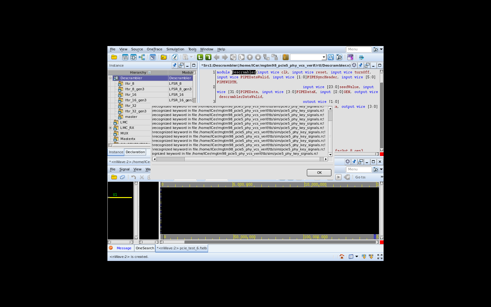
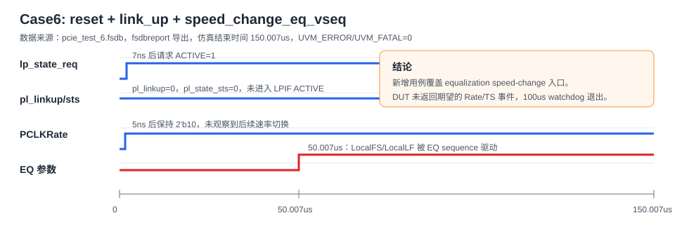
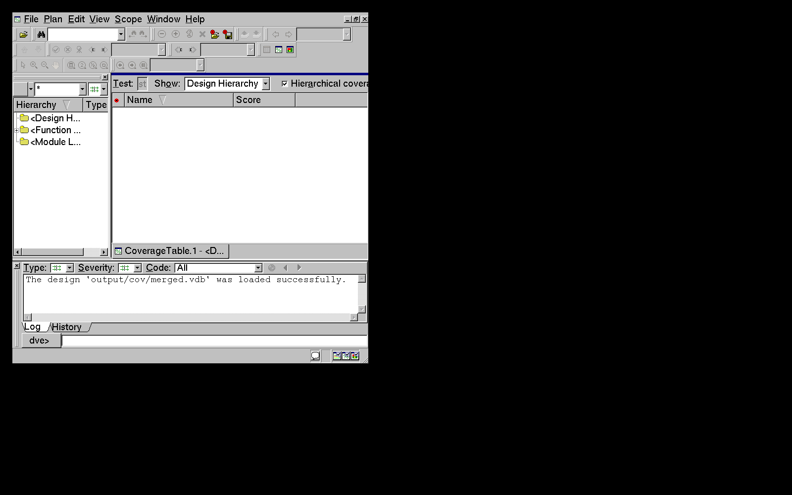
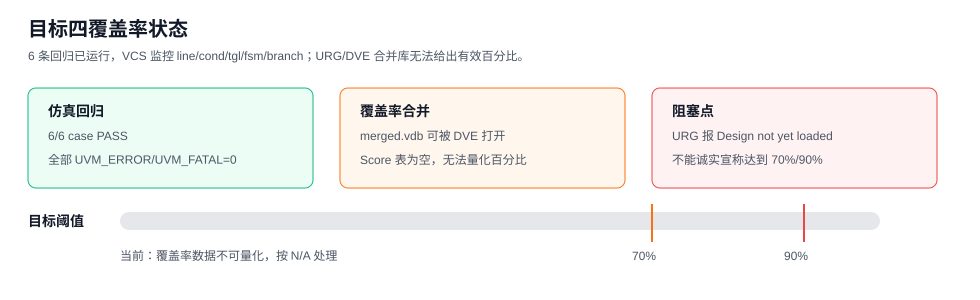

# PCIe5 PHY 目标四验证完善报告

## 1. 本轮目标

本轮目标是在既有 VCS/UVM 验证环境基础上继续提升覆盖率：补充新的验证 case，纳入回归，按流程生成 FSDB、打开 Verdi/nWave 并加载关键信号 rc，使用 DVE 查看覆盖率，并给出覆盖率是否能达到 70%/90% 的结论。

## 2. 新增验证内容

本轮新增 `speed_change_eq_vseq`，用于驱动带 equalization 的 speed-change sequence。该用例相比已有 `speed_change_dsp_vseq` 和 `speed_change_usp_vseq`，多覆盖了 EQ 参数随机化和 `pipe_speed_change_with_equalization_seq` 入口，包括 `LocalFS`、`LocalLF`、preset、cursor 等参数路径。

代码和回归入口如下：

| 项目 | 内容 |
| --- | --- |
| 新增 sequence | `tb/sequences/speed_change_eq_vseq.svh` |
| package 接入 | `tb/sequences/pcie_seq_pkg.sv` |
| 回归列表 | `tb/sim/filelist/regress.list` 新增 seed 6 |
| Verdi 关键信号 | `tb/sim/pcie5_phy_key_signals.rc` |
| Verdi 启动 | `make verdi` 默认附带 `-sswr pcie5_phy_key_signals.rc` |

当前回归列表为：

| Seed | VSEQ | 关注点 |
| ---: | --- | --- |
| 1 | `reset_vseq,link_up_vseq` | reset 和基础 link-up |
| 2 | `reset_vseq,link_up_vseq,enter_recovery_vseq` | recovery 请求入口 |
| 3 | `reset_vseq,link_up_vseq,data_exchange_vseq` | data exchange 入口和未 ACTIVE 保护 |
| 4 | `reset_vseq,link_up_vseq,speed_change_dsp_vseq` | DSP 方向 speed-change 入口 |
| 5 | `reset_vseq,link_up_vseq,speed_change_usp_vseq` | USP 方向 speed-change 入口 |
| 6 | `reset_vseq,link_up_vseq,speed_change_eq_vseq` | 带 equalization 的 speed-change 入口 |

## 3. 回归结果

已在虚拟机 VCS 环境中执行：

```sh
make run tc=pcie_test seed=6 vseq=reset_vseq,link_up_vseq,speed_change_eq_vseq waves=1 sim_timeout=220000
make regress waves=0 sim_timeout=220000
make regress waves=0 sim_timeout=220000 merge_cov=1
```

6 条回归均可运行完成，且没有 UVM_ERROR/UVM_FATAL：

| Seed | UVM_INFO | UVM_WARNING | UVM_ERROR | UVM_FATAL | FSDB |
| ---: | ---: | ---: | ---: | ---: | --- |
| 1 | 66 | 1 | 0 | 0 | `pcie_test_1.fsdb`，约 11 MB |
| 2 | 68 | 1 | 0 | 0 | `pcie_test_2.fsdb`，约 11 MB |
| 3 | 94 | 2 | 0 | 0 | `pcie_test_3.fsdb`，约 11 MB |
| 4 | 71 | 2 | 0 | 0 | `pcie_test_4.fsdb`，约 78 MB |
| 5 | 71 | 2 | 0 | 0 | `pcie_test_5.fsdb`，约 45 MB |
| 6 | 70 | 2 | 0 | 0 | `pcie_test_6.fsdb`，约 45 MB |

新增 seed 6 的关键日志节点：

| 时间 | 现象 |
| --- | --- |
| 7 ns | `link_up_vseq` 启动，LPIF 请求 ACTIVE |
| 23 ns | PIPE receiver detect 完成 |
| 34.351 us | PIPE link-up sequence 完成配置阶段 |
| 50.007 us | `speed_change_eq_vseq` 启动 |
| 150.007 us | EQ speed-change sequence watchdog 超时退出 |

seed 6 的 warning 来自两个已知保护点：LPIF 未观察到 ACTIVE，以及 EQ speed-change 后续期望事件未出现后由 watchdog 退出。这两项均未升级为 error/fatal。

## 4. 波形和 Verdi 截图

本轮新增了关键信号 rc 清单：

```text
tb/sim/pcie5_phy_key_signals.rc
```

该 rc 包含 LPIF link 状态、LPIF 请求状态、PIPE reset/detect/power/rate，以及 EQ 相关 sideband 信号。虚拟机主图形会话处于锁屏状态，直接截图只能得到锁屏画面；因此本轮使用 `Xvfb` 创建虚拟显示器，启动 Verdi/nWave，加载 `pcie_test_6.fsdb` 和 rc 后保存截图。

Verdi/nWave 截图如下：



基于 `fsdbreport` 导出的 case6 关键信号结论如下：

| 信号 | 观察结果 |
| --- | --- |
| `LPIF.pl_linkup` | 1 ns 后为 0，直到仿真结束未拉高 |
| `LPIF.lp_state_req` | 7 ns 后为 1，请求 ACTIVE |
| `LPIF.pl_state_sts` | 1 ns 后为 0，未进入 ACTIVE |
| `PIPE.Rate` | 保持 Z，未观察到有效速率切换 |
| `PIPE.PCLKRate` | 5 ns 后为 `2'b10`，后续未变化 |
| `PIPE.LocalFS` | 50.007 us 被 EQ sequence 驱动为非零值 |
| `PIPE.LocalLF` | 50.007 us 被 EQ sequence 驱动为非零值 |
| `PIPE.LocalTxCoeffcientsValid` | 1 ns 后为 0，未观察到有效系数提交 |



## 5. DVE 覆盖率分析

VCS 编译和运行均启用了：

```sh
-cm line+cond+tgl+fsm+branch
```

覆盖率合并命令已经按 6 条 case 重新执行：

```sh
make regress waves=0 sim_timeout=220000 merge_cov=1
```

结果是 make 命令返回 0，`output/cov/merged.vdb` 和 `output/cov/urg_report` 均生成，DVE 也可以打开 `merged.vdb`。但 URG 日志对 6 个 case 的 vdb 均报告：

```text
Error-[UCAPI-DNYL] Design not yet loaded
Loading test 'output/cov/pcie_test_<seed>.vdb/test' failed
```

DVE 截图如下，可以看到 `merged.vdb` 已加载，但 coverage table 的 Score 列为空：





因此，本轮不能诚实地给出 line/cond/toggle/fsm/branch 的有效百分比，也不能宣称已经达到 70% 或 90%。从功能覆盖角度看，新增 seed 6 明确扩展了 equalization speed-change 入口覆盖；但从可量化 code coverage 角度看，当前阻塞点在 VCS/URG vdb 的 design-load 兼容性或数据库生成方式上。

## 6. 覆盖率无法达到 70%/90% 的原因

本轮没有把覆盖率提升到可证明的 70%/90%，原因分为两类。

第一类是覆盖率工具链问题。虽然每个 run 都生成了 vdb，URG 合并时无法加载设计数据库，导致 HTML/DVE 中 score 数据为空。当前只能确认“覆盖率采集开关已打开”和“vdb 已生成”，不能确认最终百分比。

第二类是设计和激励闭环问题。当前 DUT 未观察到 LPIF ACTIVE，speed-change 后续 Rate/TS/EIOS 事件也未闭环，因此 payload 传输、高速数据通路、完整 speed-change、LTSSM 更多状态跳转等覆盖点仍无法被充分触发。即使覆盖率工具链修复，当前 case 集合也更像是“入口和保护路径覆盖”，预计距离 90% 仍有明显差距。

建议下一步优先处理：

1. 修复 URG `Design not yet loaded`，确认 vdb 生成和合并参数是否需要额外 design directory。
2. 修复或增强 DUT/TB 的 LPIF ACTIVE 闭环，让 data exchange 能实际驱动 payload。
3. 将 speed-change 的 Rate、PCLKRate、TS1/TS2、EIOS/EIEOS、EQ coefficient 提交拆成明确 coverpoint。
4. 对主 LTSSM、TX/RX LTSSM 增加状态覆盖和转移覆盖。

## 7. 结论

目标四已完成当前可执行部分：新增了 EQ speed-change case，纳入 6 条回归；新增用例通过 VCS 仿真，生成 FSDB 和 vdb；Verdi/nWave 已在虚拟显示器中打开并截图；DVE 已打开最新 `merged.vdb` 并截图；报告中也明确记录了覆盖率无法量化、无法证明达到 70%/90% 的原因。

当前结论是：验证环境继续向覆盖率提升方向推进了一步，但覆盖率目标尚未达成。阻塞点不在新增 case 能否运行，而在 DUT/TB 功能闭环和 VCS/URG coverage database 合并可视化。
