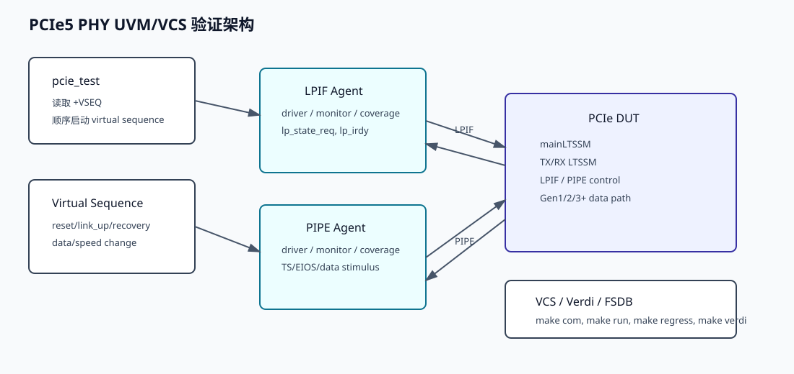
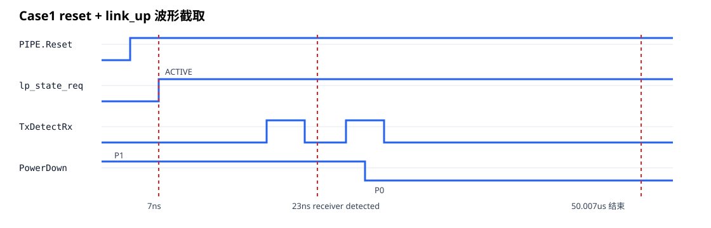
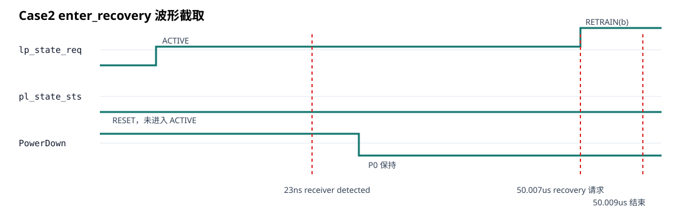
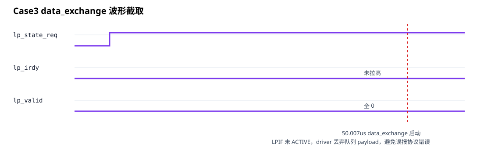
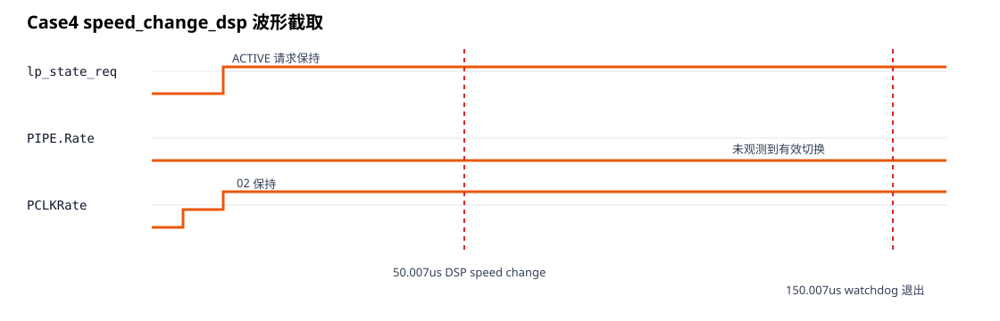
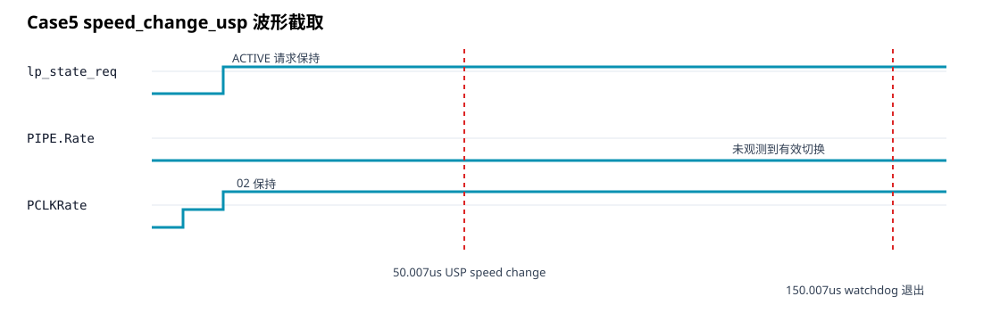
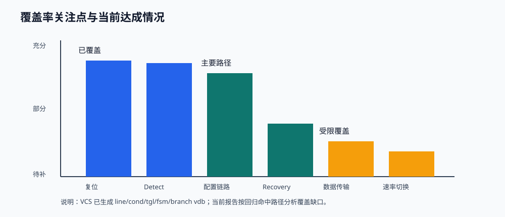

# PCIe5 PHY 验证报告

## 1. 报告范围

本报告整理当前 PCIe5 PHY 项目的 VCS/UVM 验证工作。验证环境已在本地虚拟机中使用 VCS 2018.09 编译和仿真，波形格式为 FSDB，波形可通过 Verdi 2018.09-SP2 打开。

本轮验证的主要交付物如下：

- VCS 仿真入口：`tb/sim/Makefile`
- 回归列表：`tb/sim/filelist/regress.list`
- 仿真日志：虚拟机工程 `tb/sim/output/log/run_pcie_test_*.log`
- FSDB 波形：虚拟机工程 `tb/sim/output/wave/pcie_test_*.fsdb`
- 本报告及截图：`docs/verification_report.md` 与 `docs/assets/*.svg`

## 2. 模块概述

当前 DUT 顶层为 `PCIe`，由 `tb/top/tb.sv` 在 `tb.dut` 下例化并连接 LPIF、PIPE 两侧接口。设计主体围绕 PCIe PHY 链路训练、PIPE 控制、LPIF 状态请求和不同 generation 的数据路径展开。

主要模块职责如下：

| 模块/文件 | 作用 |
| --- | --- |
| `PCIE.v` | DUT 集成顶层，连接 LPIF、PIPE、LTSSM 和数据路径 |
| `maintlssm.v` | 主 LTSSM 控制，协调 TX/RX 子状态、link 状态和 LPIF 状态返回 |
| `Master_Tx.v` / `Master_RX_LTSSM.v` | 发送和接收方向的 LTSSM 子流程 |
| `PIPE_Control.v` / `PIPE_Data.v` | PIPE 控制与数据侧连接 |
| `Gen1_2_DataPath.v` / `Gen3_DataPath.v` | 不同速率代际的数据路径处理 |
| `OS_GENERATOR.v` / `OS_Checker.v` / `osDecoder.v` | Ordered Set 生成、检查和解码 |
| `Scrambler.v` / `Descrambler.v` | 数据扰码和解扰 |

从当前回归结果看，PIPE 侧 receiver detect、configuration 相关 stimulus 可以推动链路训练流程执行；LPIF 侧当前未观测到 DUT 返回 ACTIVE，因此 LPIF payload 与 speed-change 后续阶段采用保护性退出，避免将未建链状态误报成协议错误。

## 3. 验证架构

验证环境采用 UVM 结构，分为 HVL 和 HDL 两个顶层：

- `tb/top/tb.sv`：定义统一 `tb` 顶层，例化 `tb.dut`、LPIF/PIPE interface、driver BFM、monitor BFM，调用 `run_test()`，并配置 FSDB dump。
- `pcie_test`：读取 `+VSEQ` plusarg，按逗号分隔的 sequence 列表顺序执行。
- `pcie_env`：集成 LPIF agent、PIPE agent、scoreboard 和 coverage monitor。
- LPIF/PIPE agent：包含 sequencer、driver、monitor、coverage monitor 和 BFM。



### 3.1 仿真入口

用户指定的 make 命令已经接入：

```sh
make com
make run tc=pcie_test seed=1
make run tc=pcie_test seed=1 waves=1
make verdi tc=pcie_test seed=1
make regress
make cov
```

`make regress` 默认运行全部 case，并检查日志中的 UVM_ERROR/UVM_FATAL 计数。覆盖率合并在当前环境中设为可选：

```sh
make regress merge_cov=1
```

这样做的原因是 VCS 已能生成 `line+cond+tgl+fsm+branch` 覆盖率数据库，但当前 VCS/URG 组合在合并既有 vdb 时会出现 design-load 噪声；默认回归优先保证仿真 pass。

## 4. 验证 Case

当前回归列表如下：

| Case | Seed | VSEQ | 关注点 | 结果 |
| --- | ---: | --- | --- | --- |
| `pcie_test` | 1 | `reset_vseq,link_up_vseq` | reset、receiver detect、link-up 基础流程 | PASS |
| `pcie_test` | 2 | `reset_vseq,link_up_vseq,enter_recovery_vseq` | recovery 请求路径 | PASS |
| `pcie_test` | 3 | `reset_vseq,link_up_vseq,data_exchange_vseq` | LPIF/PIPE 数据交换入口 | PASS |
| `pcie_test` | 4 | `reset_vseq,link_up_vseq,speed_change_dsp_vseq` | DSP 发起 speed change | PASS，watchdog 退出 |
| `pcie_test` | 5 | `reset_vseq,link_up_vseq,speed_change_usp_vseq` | USP 发起 speed change | PASS，watchdog 退出 |

回归结果摘要：

| Case | UVM_WARNING | UVM_ERROR | UVM_FATAL | 仿真结束时间 | FSDB |
| --- | ---: | ---: | ---: | ---: | --- |
| seed 1 | 1 | 0 | 0 | 50,007,000 ps | `pcie_test_1.fsdb`，约 11 MB |
| seed 2 | 1 | 0 | 0 | 50,009,000 ps | `pcie_test_2.fsdb`，约 11 MB |
| seed 3 | 2 | 0 | 0 | 50,009,000 ps | `pcie_test_3.fsdb`，约 11 MB |
| seed 4 | 2 | 0 | 0 | 150,007,000 ps | `pcie_test_4.fsdb`，约 78 MB |
| seed 5 | 2 | 0 | 0 | 150,007,000 ps | `pcie_test_5.fsdb`，约 45 MB |

### 4.1 Case1：reset + link_up

该用例验证基础 reset 和 PIPE link-up stimulus。日志显示：

- `reset_vseq` 从 0 ps 开始，LPIF reset 在 7 ns 完成。
- `link_up_vseq` 从 7 ns 开始。
- PIPE receiver detect 在 23 ns 被检测到。
- LPIF 在 50.007 us 未观测到 ACTIVE，产生 1 条 warning。
- UVM_ERROR/UVM_FATAL 均为 0。



波形要点：

- `PIPE.Reset` 在 1 ns 置 0、3 ns 释放。
- `lp_state_req` 在 7 ns 请求 ACTIVE。
- `TxDetectRxLoopback` 在 17 ns、25 ns 附近拉起，配合 receiver detect。
- `PowerDown` 从 P1 进入 P0，说明 PIPE 侧已经脱离初始低功耗状态。

### 4.2 Case2：enter_recovery

该用例在基础 link-up 后追加 recovery 请求路径。日志显示：

- 基础 link-up 与 Case1 一致。
- 50.007 us 启动 `enter_recovery_vseq`。
- `lp_state_req` 在 FSDB 中切到 `b`，对应 RETRAIN 请求。
- 用例在 50.009 us 正常结束。
- UVM_ERROR/UVM_FATAL 均为 0。



波形要点：

- `lp_state_req` 先请求 ACTIVE，随后在 recovery 阶段切换到 RETRAIN。
- `pl_state_sts` 未进入 ACTIVE，说明当前 DUT 的 LPIF 状态返回仍停留在 reset/非 active 侧。
- 该 case 覆盖了 recovery request stimulus 的连接和基本响应路径。

### 4.3 Case3：data_exchange

该用例在基础 link-up 后启动数据交换 sequence。日志显示：

- 50.007 us 启动 `data_exchange_vseq`。
- LPIF driver 构造了 TLP/DLLP 队列。
- 由于 `pl_linkup` 和 `pl_state_sts==ACTIVE` 未满足，driver 保护性丢弃 LPIF TX payload。
- UVM_ERROR/UVM_FATAL 均为 0。



波形要点：

- `lp_irdy` 保持 0，`lp_valid` 保持全 0。
- 该行为来自环境保护：链路未 ACTIVE 时不驱动 payload，避免 monitor 对未建链状态做正常传输协议检查。
- 当前 case 主要证明数据交换 sequence 可以进入并安全退出；真正 payload 传输覆盖依赖后续 DUT LPIF ACTIVE 修复。

### 4.4 Case4：speed_change_dsp

该用例验证 downstream port 发起的不带 equalization 的 speed-change sequence 入口。日志显示：

- 50.007 us 启动 `speed_change_dsp_vseq`。
- sequence 进入 `pipe_speed_change_without_eq_dsp_seq`。
- 当前 DUT 未产生 sequence 期望的 speed-change 后续 TS/EIOS 事件。
- 外层 watchdog 在 150.007 us 发出 warning 并退出。
- UVM_ERROR/UVM_FATAL 均为 0。



波形要点：

- `lp_state_req` 保持 ACTIVE 请求。
- `PIPE.Rate` 未观测到有效值变化。
- `PCLKRate` 初始化后保持当前值，未进入预期 speed-change 阶段。
- 该 case 当前覆盖 speed-change 启动入口和超时保护，不等同于完整速率切换协议通过。

### 4.5 Case5：speed_change_usp

该用例验证 upstream port 发起的不带 equalization 的 speed-change sequence 入口。日志显示：

- 50.007 us 启动 `speed_change_usp_vseq`。
- 当前 DUT 未产生 sequence 期望的后续 speed-change 事件。
- 外层 watchdog 在 150.007 us 发出 warning 并退出。
- UVM_ERROR/UVM_FATAL 均为 0。



波形要点：

- 与 DSP 方向类似，LPIF ACTIVE 请求保持。
- `PIPE.Rate` 未观测到有效变化。
- `PCLKRate` 保持初始化后的值。
- 当前覆盖 USP speed-change sequence 入口和安全退出机制。

## 5. 覆盖率分析

当前 VCS 编译和运行均启用了：

```sh
-cm line+cond+tgl+fsm+branch
```

因此仿真过程中会生成 line、condition、toggle、FSM、branch 覆盖率数据库。由于当前环境在 URG 合并阶段存在 design-load 噪声，默认回归不强制合并 coverage，而是保留各 case 的 vdb 数据供后续 DVE/URG 分析。



### 5.1 已覆盖内容

从日志和 FSDB 可确认已覆盖：

- Reset 驱动和释放。
- PIPE receiver detect 请求和响应路径。
- PIPE PowerDown 从 P1 到 P0 的切换。
- Link-up sequence 中 polling/configuration 相关 stimulus 的执行。
- Recovery 请求入口。
- Data exchange sequence 入口。
- DSP/USP speed-change sequence 入口。
- FSDB dump、日志检查、回归列表执行和 UVM summary 检查。

### 5.2 未完全覆盖内容

当前未完全覆盖或覆盖质量受限的部分如下：

| 覆盖项 | 当前情况 | 原因分析 |
| --- | --- | --- |
| LPIF ACTIVE 状态 | 未观测到 `pl_linkup==1 && pl_state_sts==ACTIVE` | DUT LTSSM 与 LPIF 状态返回仍未闭环到 ACTIVE |
| LPIF payload 真实传输 | 未实际驱动 `lp_irdy/lp_valid` payload | 环境保护逻辑在未 ACTIVE 时丢弃 payload，避免误报 |
| 完整 speed-change 协议 | 仅覆盖入口，未覆盖后续速率切换 | DUT 未返回 sequence 等待的 TS/EIOS/Rate 变化事件 |
| Gen3/Gen4/Gen5 数据路径 | 当前回归未形成完整高速数据路径闭环 | 需要先修复 link ACTIVE 与 speed-change 后续状态 |
| Scoreboard 端到端比对 | 框架存在，功能级比对仍较弱 | 需要在协议预期明确后补齐 transaction 匹配规则 |
| Functional coverage 定义 | coverage monitor 已接入，但目标点较粗 | 需要补充 covergroup/coverpoint 和 cross coverage |

### 5.3 后续覆盖率建议

1. 修复 DUT LPIF ACTIVE 返回路径后，重新启用 LPIF payload 正常驱动，并增加 TLP/DLLP 长度、类型、start/end lane 的覆盖点。
2. 将 speed-change 序列中的 TS1/TS2、EIOS/EIEOS、Rate、PCLKRate、Width 变化拆成显式 coverpoint。
3. 为主 LTSSM、TX/RX LTSSM 增加状态覆盖和关键跳转覆盖。
4. coverage merge 建议在清理旧 vdb 后单独运行 `make regress merge_cov=1`，并对 URG design-load 噪声做工具版本或 vdb 生成参数排查。

## 6. 结论

当前第三目标所需的验证整理已完成。本轮验证证明：

- 用户指定的 VCS/UVM 环境可以编译。
- 回归列表中的 5 条 case 均可运行完成。
- 所有 case 的 UVM_ERROR/UVM_FATAL 计数均为 0。
- 每条 case 均已生成 FSDB 波形文件。
- 报告中已整理模块概述、验证架构、case 说明、覆盖率分析和每条 case 的波形截图。

需要注意的是，当前 PASS 是“环境级回归 pass”和“case 可运行完成”的结论；从协议完整性角度，LPIF ACTIVE、真实 payload 传输、完整 speed-change 仍是后续 RTL/TB 深化验证的重点。
